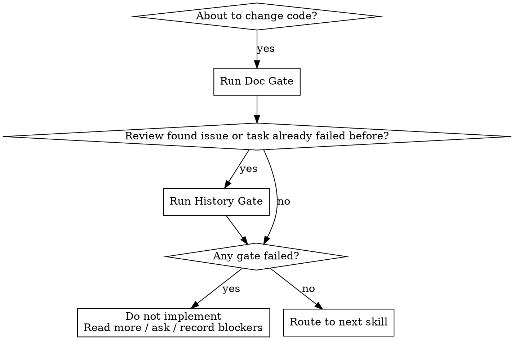

# Errors

## Overview

Block implementation until work is grounded in evidence. Require document/code reading before edits, require historical-lesson review before retries, and require new error records when failures expose reusable mistakes.

**Violating the letter of these rules is violating the spirit of these rules.** Do not bypass the gate with "quick fix", "just try it", "I'll adjust after", or "the docs are probably outdated".

## When To Stop



Run this skill whenever implementation is imminent. If you are still only discussing scope, use the normal planning or brainstorming workflow instead.

## Core Gates

### 1. Doc Gate

Before editing anything, read the minimum material needed to stop guessing:

- task-relevant docs, specs, design notes, standards, ADRs, or README files
- existing code paths that already solve the same or adjacent problem
- tests that define current behavior
- review comments or bug reports that describe the failure

Do not claim this gate passed unless you can list:

- what you read
- what each source constrained
- what remains unknown

If there is no documentation, say that explicitly and use existing code/tests as the grounding source. "No docs found" is not permission to guess without inspecting implementation.

### 2. History Gate

Run this gate when any of the following is true:

- the task is a bugfix, regression, rollback, or repeated repair
- the user says this was already tried or failed multiple times
- review found issues that require rework
- you already attempted one fix path in the current session

Search the error store progressively instead of loading everything. Read [references/error-triage-rules.md](./references/error-triage-rules.md) for the full method.

For this repository, use `D:\GitHubPro\AllGameInAI\openspec\errors` when it exists.
For other repositories, prefer `<repo>/openspec/errors`. If no repository-local error store exists, say so explicitly and create one only when it is appropriate for the workspace.

Do not pass this gate unless you can state:

- which historical errors were considered
- which lessons apply now
- which repeat path must be avoided this time
- which verification proves the repeat did not happen

### 3. Action Gate

Only after all required gates pass may you continue:

- bug or unexpected behavior: use `systematic-debugging`
- feature or behavior change: use `brainstorming`, then `writing-plans` when required
- implementation after design is settled: use `test-driven-development`

If a required gate fails, do not write code, do not stage edits, and do not present speculative patches as progress.

### 4. Post-Failure Gate

Whenever development fails or review finds a real issue, decide whether to write to the error store. This decision is mandatory every time; silence is not allowed.

Use [references/error-triage-rules.md](./references/error-triage-rules.md) to decide:

- `Record to errors: yes`
- `Record to errors: no`

If `yes`, create or update the entry in the current turn. Do not defer it.

## Required Output

Before implementation, emit this structure:

```md
Preflight Check
- Task:
- Code/doc evidence read:
- Key constraints extracted:
- Unknowns that still block certainty:

History Check
- Error search scope:
- Candidate historical errors:
- Reused lessons for this task:
- Repetition risks to avoid this time:

Go/No-Go
- Doc gate: pass/fail
- History gate: pass/fail/na
- Allowed next step:
```

After a failure or review issue, emit this structure:

```md
Error Recording Decision
- Record to errors: yes/no
- Reason:
- Action: create/update/skip
- Error file:
```

## Error Store Rules

Use the repository-local template when one exists. Otherwise use [references/error-entry-template.md](./references/error-entry-template.md).

Default to updating an existing error when the same root cause already exists. Create a new entry only when the root cause or corrective constraint is materially different.

Required fields for each entry:

- `id`
- `title`
- `symptoms`
- `trigger_scope`
- `root_cause`
- `bad_fix_paths`
- `corrective_constraints`
- `verification_evidence`
- `keywords`
- `updated_at`

## Red Flags

If you think any of these, stop and rerun the gate:

- "I'll patch first and read after"
- "The user already explained enough"
- "I remember this module"
- "This looks like the same bug, I'll repeat the last fix"
- "Review only found a minor issue, no need to record it"
- "There are too many past errors to read, I'll skip them"

## Example

```md
Preflight Check
- Task: Fix config save failure in launcher profile editor.
- Code/doc evidence read:
  - docs/launcher/profile-flow.md -> save is fail-closed and must not fake success.
  - src/Launcher/ProfileStore.cs -> current persistence path and validation order.
  - tests/ProfileStoreTests.cs -> expected duplicate-name behavior.
- Key constraints extracted:
  - Failed save must surface error, not silently fallback.
  - Validation must happen before persistence.
- Unknowns that still block certainty:
  - None.

History Check
- Error search scope: openspec/errors with keywords `profile save`, `silent fallback`, `launcher`.
- Candidate historical errors:
  - E-2026-0003-silent-fallback-on-save
- Reused lessons for this task:
  - Do not convert IO failure into success UI.
- Repetition risks to avoid this time:
  - Reusing the previous "save locally then warn later" patch.

Go/No-Go
- Doc gate: pass
- History gate: pass
- Allowed next step: systematic-debugging
```

## Common Mistakes

| Mistake | Correction |
|---------|------------|
| Reading one file and calling it enough | Read docs plus current implementation or tests. |
| Dumping the whole error library into context | Search first, then load only the most relevant entries. |
| Treating review findings as "not real failures" | Review issues can expose reusable mistakes; evaluate them for recording. |
| Creating duplicate error entries by default | Update existing entries unless the root cause truly differs. |
| Marking History Gate `na` during a retry | A retry means history is relevant. Search the error store. |
