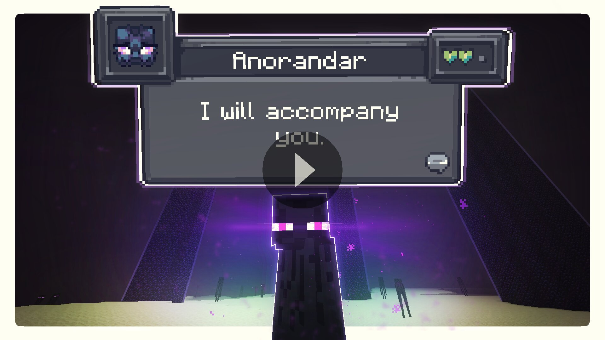
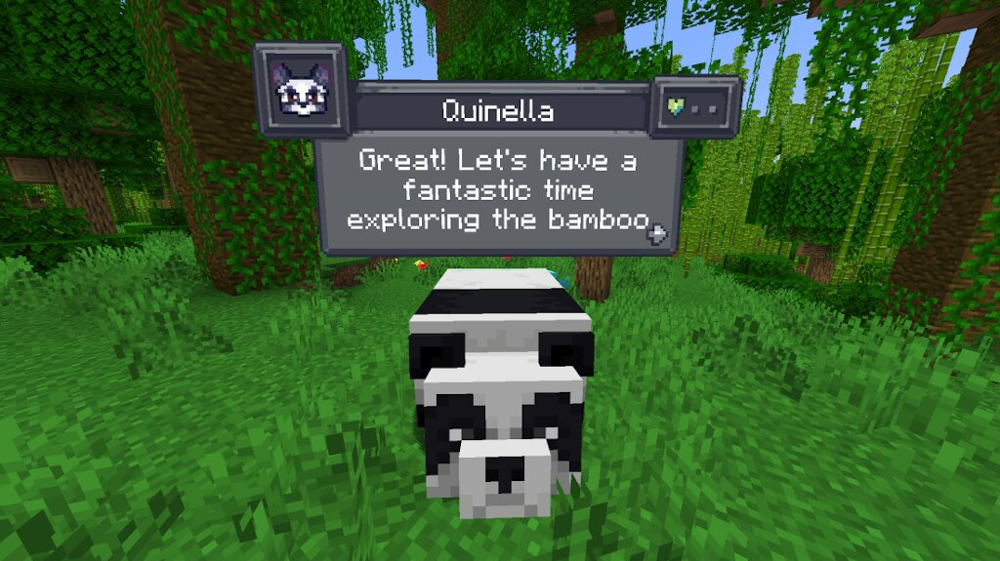
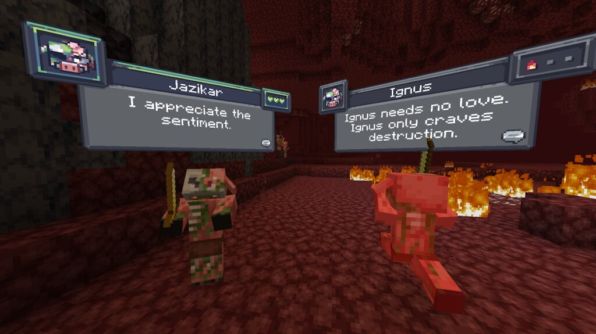

# CreatureChat™

## Chat with any mob in Minecraft! All creatures can talk & react using AI!

### Features
- **AI-Driven Chats:** Using ChatGPT or open-source AI models, each conversation is unique and engaging!
- **Behaviors:** Creatures can make decisions on their own and **Follow, Flee, Attack, Protect**, and more!
- **Reactions:** Creatures automatically react to being damaged, shown items, or receiving or loosing items.
- **Friendship:** Track your relationships from friends to foes.
- **Multi-Player:** Share the experience; conversations sync across server & players.
- **Memory:** Creatures remember your past interactions, making each chat more personal.
- **Inventory:** Every mob has an inventory with random loot. Give items to your friends or take items to create enemies.
- **Advancements:** Earn unique CreatureChat milestones as your friendships progress.

### Create meaningful conversations and enduring friendships? A betrayal perhaps?

## Installation Instructions
### Fabric (Recommended)

1. **Install Fabric Loader & API:** Follow the instructions [here](https://fabricmc.net/use/).
2. **Install CreatureChat Mod:** Download and copy `creaturechat-*.jar` and `fabric-api-*.jar` into your `.minecraft/mods` folder.
3. **Launch Minecraft** with the Fabric profile.
4. **Configure AI:** A LLM (large language model) is required for generating text (AI options **listed below**)

### Forge (with Sinytra Connector)
*NOTE: Sintra Connector only supports Minecraft 1.20.1.*

1. **Install Forge:** Download [Forge Installer](https://files.minecraftforge.net/), run it, select "Install client".
2. **Install Forgified Fabric API:** Download [Forgified Fabric API](https://curseforge.com/minecraft/mc-mods/forgified-fabric-api) and copy the `*.jar` into your `.minecraft/mods` folder.
3. **Install Sinytra Connector:** Download [Sinytra Connector](https://www.curseforge.com/minecraft/mc-mods/sinytra-connector) and copy the `*.jar` into your `.minecraft/mods` folder.
4. **Install CreatureChat Mod:** Download and copy `creaturechat-*.jar` into your `.minecraft/mods` folder.
6. **Launch Minecraft** with the Forge profile.
7. **Configure AI:** A LLM (large language model) is required for generating text (AI options **listed below**)

## AI Options
CreatureChat™ **requires** an AI / LLM (large language model) to generate text (characters and chat). There are many different
options for connecting an LLM. 

1. **Free & Local**: Use open-source and free-to-use LLMs without any API fees. [**Difficulty: Hard**]
2. **Bring Your Own Key**: Use your own API key from providers like OpenAI or Groq. [**Difficulty: Medium**]
3. **Token Shop**: Supports CreatureChat by purchasing tokens from the developers on Discord. [**Difficulty: Easy**]

### 1. Free & Local
CreatureChat™ fully supports **free and open-source** LLMs. To get started:

- An HTTP endpoint compatible with the OpenAI Chat Completion JSON syntax is required. We highly recommend using:
  - [Ollama](https://ollama.com/) & [LiteLLM](https://litellm.vercel.app/) as your HTTP proxy.
  - **LiteLLM Features:**
    - Supports over **100+ LLMs** (e.g., Anthropic, VertexAI, HuggingFace, Google Gemini, and Ollama).
    - Proxies them through a local HTTP endpoint compatible with CreatureChat.
    - **Note:** Running a local LLM on your computer requires a powerful GPU.
  - Set the local HTTP endpoint in-game:
    - `/creaturechat url set "http://ENTER-YOUR-HTTP-ENDPOINT-FROM-LITE-LLM"`
    - `/creaturechat model set ENTER-MODEL-NAME`
    - `/creaturechat timeout set 360`
  - Additional help can be found in the **#locall-llm-info** channel on our [Discord](https://discord.gg/m9dvPFmN3e).

### 2. Bring Your Own Key
For those already using a third-party API (e.g., OpenAI, Groq):

- Integrate your own API key for seamless connectivity.
- Costs depend on the provider’s usage-based pricing model.
- By default, CreatureChat™ uses the OpenAI endpoint and `gpt-3.5-turbo` model, known for its balance of low cost and fast performance.
- Be aware that OpenAI’s developer API does not include free usage. Please review the [OpenAI pricing](https://openai.com/api/pricing/) for detailed information.
- To create an OpenAI API key, visit [https://platform.openai.com/api-keys](https://platform.openai.com/api-keys), and use the **+ Create new secret key** button.
- Set the API key & model in-game:
  - `/creaturechat key set <YOUR-SECRET-KEY-HERE>`
  - `/creaturechat model set gpt-3.5-turbo`

### 3. Token Shop
Supports CreatureChat™ by purchasing tokens from the developers:

- Easy setup with simple token packs, created for CreatureChat users.
- More info is available in the #token-shop channel on our [Discord](https://discord.gg/m9dvPFmN3e).
- Set the token-shop API key in-game:
  - `/creaturechat key set <YOUR-SECRET-KEY-HERE>`

### In-game Commands / Configuration
- **REQUIRED:** `/creaturechat key set <key>`
  - Sets the *OpenAI API key*. This is required for making requests to the LLM.
- **OPTIONAL:** `/creaturechat url set "<url>"`
  - Sets the URL of the API used to make LLM requests. Defaults to `"https://api.openai.com/v1/chat/completions"`.
- **OPTIONAL:** `/creaturechat model set <model>`
  - Sets the model used for generating responses in chats. Defaults to `gpt-3.5-turbo`.
- **OPTIONAL:** `/creaturechat timeout set <seconds>`
  - Sets the timeout (in seconds) for API HTTP requests. Defaults to `10` seconds.
- **OPTIONAL:** `/creaturechat whitelist <entityType | all | clear>` - Show chat bubbles
  - Shows chat bubbles for the specified entity type or all entities, or clears the whitelist.
- **OPTIONAL:** `/creaturechat blacklist <entityType | all | clear>` - Hide chat bubbles
  - Hides chat bubbles for the specified entity type or all entities, or clears the blacklist.
- **OPTIONAL:** `/story set "<story-text>"`
  - Sets a custom story (included in character creation and chat prompts).
- **OPTIONAL:** `/story display | clear`
  - Display or clear the current story.

#### Configuration Scope (default | server):
- **OPTIONAL:** Specify the configuration scope at the end of each command to determine where settings should be applied:
  - **Default Configuration (`--config default`):** Applies the configuration universally, unless overridden by a server-specific configuration.
  - **Server-Specific Configuration (`--config server`):** Applies the configuration only to the server where the command is executed.
  - If the `--config` option is not specified, the `default` configuration scope is assumed.

### Screenshots

### Authors

- Jonathan Thomas <jonathan@openshot.org>
- owlmaddie <owlmaddie@gmail.com>

### Contact & Resources

- [Join us on Discord](https://discord.gg/m9dvPFmN3e)
- [Build Instructions](INSTALL.md) ([Source Code](https://github.com/CreatureChat/creature-chat))
- [Player & Entity Icon Tutorial](ICONS.md)
- Download from [Modrinth](https://modrinth.com/project/creaturechat)
- Follow Us: [YouTube](https://www.youtube.com/@CreatureChat/featured) | 
[Twitter](https://twitter.com/TheCreatureChat) |
[TikTok](https://www.tiktok.com/@creaturechat)

### License

- 
- **Source code:** [GNU GPL v3](LICENSE.md)
- **Non-code assets:** [CC-BY-NC-SA-4.0](LICENSE-ASSETS.md)

### Legal Notices

- By using CreatureChat™ you agree to our [Terms of Service](TERMS.md) and [Privacy Policy](PRIVACY.md).
- CreatureChat™ is an independent project and is **not** endorsed by Mojang AB, Microsoft Corp., or OpenAI. *Minecraft®* is a trademark of Mojang AB. *ChatGPT®* is a trademark of OpenAI OpCo, LLC. All trademarks appear here for identification only.
- *CreatureChat™* is a trademark of owlmaddie LLC (registration pending). Factual nominative references such as “Fork of CreatureChat” that do **not** imply endorsement are allowed; all other uses of the name or logo require prior permission.
