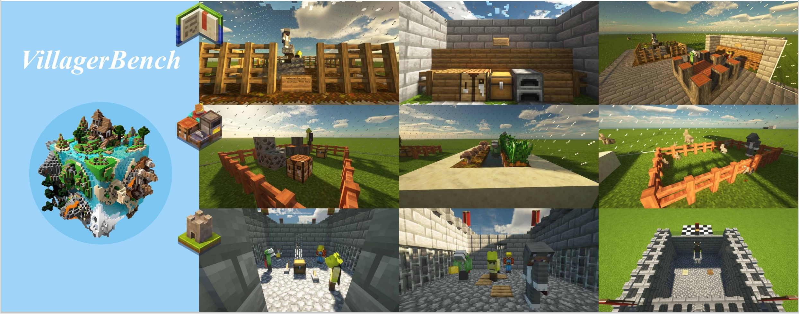
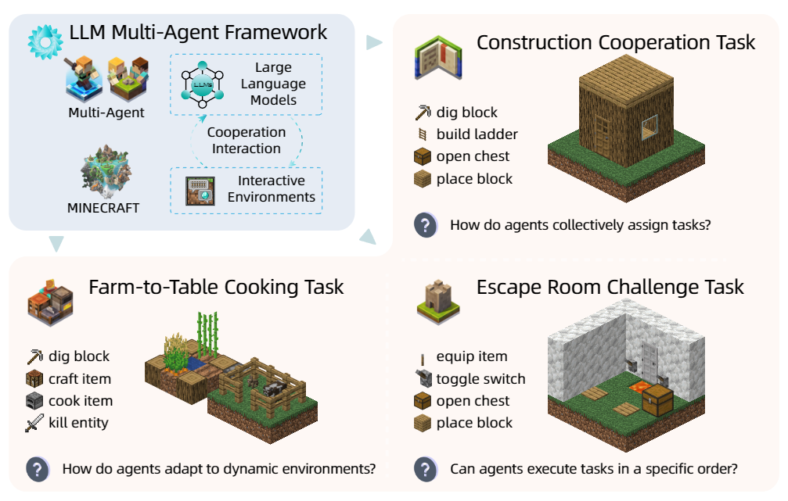
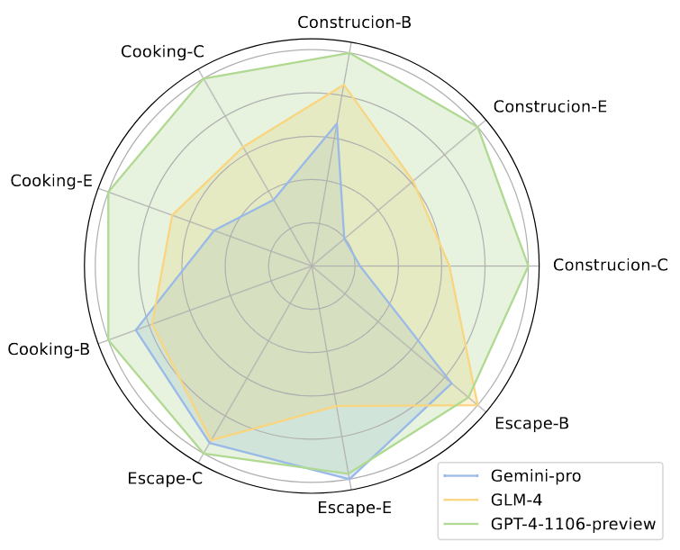
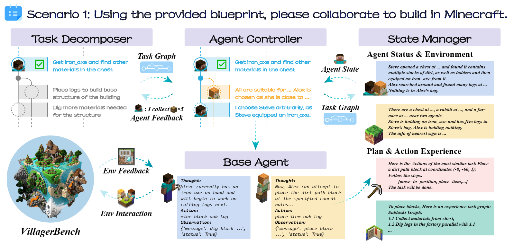

# 🏰 VillagerAgent：Minecraft 世界中的团队合作基准测试 🌍



我们希望打造一个更加智能的多智能体与玩家实时合作的我的世界游戏体验，同时研究其中的LLM任务合作与推理能力。

欢迎来到VillagerBench，在这个由方块构成的 Minecraft 世界中，不仅仅是为了娱乐和游戏——这里是多智能体合作前沿技术的试验场！🤖 我们的基准测试套件旨在挑战虚拟智能体共同完成的极限，从建筑项目 🏗️ 到烹饪任务 🍳，再到逃脱房间的谜题 🔐。

在您的 Minecraft 服务器中使用我们的 VillagerAgent 多智能体框架自定义您的私人任务，为您打造个性化的游戏体验！🌟

Click here to view the [English version of the README](README.md).

<p align="center">
    <a href='https://arxiv.org/abs/2406.05720'>
      
    </a>
    <a href='https://cnsdqd-dyb.github.io/workshare/2024/04/01/VillagerAgent.html'>
      
    </a>
</p>

---

## 最新进展
我们正在尝试使用经过微调的开源LLM来代替VillagerAgent中的LLM以提升智能体执行任务的性能和效率。

论文VillagerAgent被ACL2024接收。

## 设置和配置 🛠️

### 要求
- **Python版本**：系统中安装了Python 3.8或更新版本。
- **API密钥**：从以下一个或多个模型平台获取相应的API密钥：
  - OpenAI（用于访问如GPT-3等模型）
  - Google Cloud（用于访问如Gemini等模型）
  - Zhipu AI（用于访问GLM模型）
- **NPM包管理器**：[安装Node.js和npm](#npm安装)并且通过以下命令安装所需要的包：
  ```python
  python js_setup.py
  ```
- **Minecraft服务器**：如果您想了解如何配置Minecraft 1.19.2服务器，请参阅[这里的教程](#minecraft-1192服务器配置)。

- **Python依赖项**：安装`requirements.txt`文件中指定的所有必要Python库。您可以使用以下命令安装这些依赖项：
  ```
  pip install -r requirements.txt
  ```
- **其他模型**：您可以选择使用Hugging Face的Transformers库中的模型。如果您使用的是需要API密钥的模型，确保你获得下载许可或相应权限。

### 安装步骤
1. 克隆仓库以获取项目 📦：
   ```bash
   git clone https://github.com/cnsdqd-dyb/VillagerAgent.git
   ```
2. 选择使用虚拟环境 🧹：
   ```bash
   python -m venv venv
   source venv/bin/activate  # 在 Windows 上，尝试 venv\Scripts\activate
   ```
3. 安装依赖项 🧑‍🍳：
   ```bash
   pip install -r requirements.txt
   ```
4. 设置您的 API 密钥 🗝️：
   - 创建一个名为 `API_KEY_LIST` 的文件，并按以下方式记录您的 API 密钥：
   ```json
   {
      "OPENAI":["put your openai key here", ...],
      "GEMINI":[...],
      "GLM":[...],
      ...
   }
   ```
   - 我们可能会尝试调用多个可用的API以突破访问上限。
   - 将此文件放在项目的根目录。

## 快速启动 🚀

```python
from env.env import VillagerBench, env_type, Agent
from pipeline.controller import GlobalController
from pipeline.data_manager import DataManager
from pipeline.task_manager import TaskManager
import json

if __name__ == "__main__":

    # 🌍 Set Environment
    env = VillagerBench(env_type.construction, task_id=0, _virtual_debug=False, dig_needed=False)

    # 🤖 Set Agent
    api_key_list = json.load(open("API_KEY_LIST", "r"))["OPENAI"]  # 🗝️ Use OPENAI as an example
    base_url = "base url of the model"
    llm_config = {
        "api_model": "fill in the model name here",  # For example, "gpt-4-1106-preview"
        "api_base": base_url,  # 🔗 For example, "https://api.openai.com/v1"
        "api_key_list": api_key_list
    }

    Agent.model = "fill in the agent model name here"  # 🛠️ Customize your agent model
    Agent.base_url = base_url
    Agent.api_key_list = api_key_list

    # 🔨 More agent tools can be added here - refer to the agent_tool in doc/api_library.md
    agent_tool = [Agent.fetchContainerContents, Agent.MineBlock, ..., Agent.handoverBlock]

    # 📝 Register Agent
    env.agent_register(agent_tool=agent_tool, agent_number=3, name_list=["Agent1", "Agent2", "Agent3"])  # Ensure the agent number matches the agent_tool
    # ⚠️ Use /op to give the agent permission to use commands on the Minecraft server, e.g., /op Agent1

    # 🏃‍♂️ Run Environment
    with env.run():
        
        # Set Data Manager
        dm = DataManager(silent=False)
        dm.update_database_init(env.get_init_state())

        # Set Task Manager
        tm = TaskManager(silent=False)

        # Set Controller
        ctrl = GlobalController(llm_config, tm, dm, env)

        # Set Task
        tm.init_task("Write your task description here.", json.load(open("your json task related file here if any.")))

        # 🚀 Run Controller
        ctrl.run()
```

### 批量测试 🧪
- 使用 `config.py` 制作测试配置 📝。
- 使用 `start with config.py` 开始自动化批量测试 🤖。

### Docker 🐳
- 使用 `docker build -t VillagerAgent .` 构建您的 Docker 镜像 🏗。
- 使用 `docker run VillagerAgent` 启动 Docker 容器 🚀。
- 提示：使用 `docker run -p <your_port>:<app_port> VillagerAgent` 启动容器来开放特定端口以实现 API 连接，并可能需要相应地修改 Dockerfile 🌐。

## 概览 📜

### VillagerBench
通过 Mineflayer 强力驱动的VillagerBench，探索协作 AI 的动态。我们的智能体不仅仅是玩耍——它们会学习 🎓、适应 🔄，并共同努力克服单打独斗者难以解决的挑战 🐺。

 
 

### VillagerAgent 框架
认识 VillagerAgent，我们的多智能体大师 🎼，它的四大核心组件：任务分解器、智能体控制器、状态管理器和基础智能体，就像是 AI 的指挥家，将个体行动转化为协作的杰作。



## 核心组件 🌟

- **VillagerBench**：智能体互动和学习的虚拟沙盒 🤹。
- **TaskManager**：任务图的策划者，确保任务按计划进行，智能体了解情况 📊。
- **DataManager**：知识的守护者，紧握所有数据牌 🗃️。
- **GlobalController**：全局监督者，确保每个智能体完美发挥其角色 🎯。

## npm安装
### Windows

1. **下载Node.js安装程序**：
   - 访问[Node.js官网](https://nodejs.org/)。
   - 下载适用于Windows的最新稳定版Node.js安装程序（通常会有LTS版本推荐下载）。

2. **运行安装程序**：
   - 双击下载的安装程序文件。
   - 按照安装向导的指示进行安装。确保在安装过程中勾选了包括npm的所有必要组件。

3. **验证安装**：
   - 打开命令提示符或PowerShell。
   - 输入以下命令来检查Node.js和npm的版本：
     ```
     node -v
     npm -v
     ```
   - 如果安装成功，你将看到输出的Node.js和npm的版本号。

### Linux（基于Debian/Ubuntu）

1. **使用包管理器安装**：
   - 打开终端。
   - 首先，更新你的包索引：
     ```
     sudo apt update
     ```
   - 安装Node.js和npm：
     ```
     sudo apt install nodejs npm
     ```

2. **使用nvm安装**（Node Version Manager，推荐用于管理多个Node.js版本）：
   - 打开终端。
   - 安装nvm：
     ```
     curl -o- https://raw.githubusercontent.com/nvm-sh/nvm/v0.39.1/install.sh | bash
     ```
   - 重启终端或运行以下命令来更新当前会话：
     ```
     export NVM_DIR="$([ -z "${XDG_CONFIG_HOME-}" ] && printf %s "${HOME}/.nvm" || printf %s "${XDG_CONFIG_HOME}/nvm")"
     [ -s "$NVM_DIR/nvm.sh" ] && \. "$NVM_DIR/nvm.sh" # This loads nvm
     ```
   - 使用nvm安装Node.js（这将同时安装npm）：
     ```
     nvm install node
     ```

3. **验证安装**：
   - 输入以下命令来检查Node.js和npm的版本：
     ```
     node -v
     npm -v
     ```
   - 如果安装成功，你将看到输出的Node.js和npm的版本号。

## Minecraft 1.19.2服务器配置
### 准备工作

1. **确保Java安装**：Minecraft服务器需要Java运行环境。请确保您的计算机上安装了最新版本的Java。可以在命令行中运行 `java -version` 来检查Java是否已安装。

2. **下载服务器文件**：访问Minecraft官方网站下载1.19.2版本的服务器文件（`minecraft_server.1.19.2.jar`）。

### 配置服务器

1. **创建服务器文件夹**：在您的计算机上选择一个位置创建一个新文件夹，用于存放Minecraft服务器的所有文件。

2. **移动服务器文件**：将下载的服务器文件（`minecraft_server.1.19.2.jar`）移动到您创建的文件夹中。

3. **运行服务器**：
   - 打开命令行界面。
   - 使用 `cd` 命令导航到包含服务器文件的文件夹。
   - 运行以下命令启动服务器：
     ```
     java -Xmx1024M -Xms1024M -jar minecraft_server.1.19.2.jar nogui
     ```
   - 这里的 `-Xmx1024M` 和 `-Xms1024M` 参数分别设置了服务器的最大和初始内存分配（以MB为单位）。根据您的服务器硬件，您可能需要调整这些值。

4. **接受EULA**：首次运行服务器时，会生成一个名为 `eula.txt` 的文件。打开这个文件，将 `eula=false` 改为 `eula=true` 来接受Minecraft最终用户许可协议。

5. **重新启动服务器**：再次运行上述 `java` 命令来启动服务器。

### 配置服务器属性

1. **编辑`server.properties`文件**：服务器首次运行后，会生成一个名为 `server.properties` 的配置文件。您可以编辑这个文件来自定义服务器的设置，例如游戏模式、难度等。如果要测试多智能体在VillagerBench上的能力，请将模式设定为和平，地形设为超平坦模式。

2. **端口转发**：如果您希望其他玩家能够从外部网络访问您的服务器，您可能需要在路由器上设置端口转发。默认情况下，Minecraft服务器使用25565端口。

3. **启动并测试服务器**：完成所有设置后，重新启动服务器，并尝试连接到服务器以确保一切正常运行。

### 注意事项

- 请确保服务器中可能加入的智能体已经获得了管理员权限（/op agent_name的方式可以添加权限）。
- 确保您的服务器防火墙规则允许Minecraft服务器使用的端口。
- 定期备份您的服务器文件，以防数据丢失。
- 保持服务器的Java版本更新，以获得最佳性能和安全性。

以上步骤提供了一个基本的Minecraft服务器设置教程。根据您的具体需求和配置，可能还需要进行更多的高级设置。

## 贡献指南 🤝

加入我们吧！我们欢迎贡献。在您提交拉取请求之前，请确保：
- 您的更改通过了测试 🏆。
- 如果您添加了一些新内容，请更新文档 📚。

## 许可证 📜

本项目在 [MIT 许可证](LICENSE) 下完全开放。
